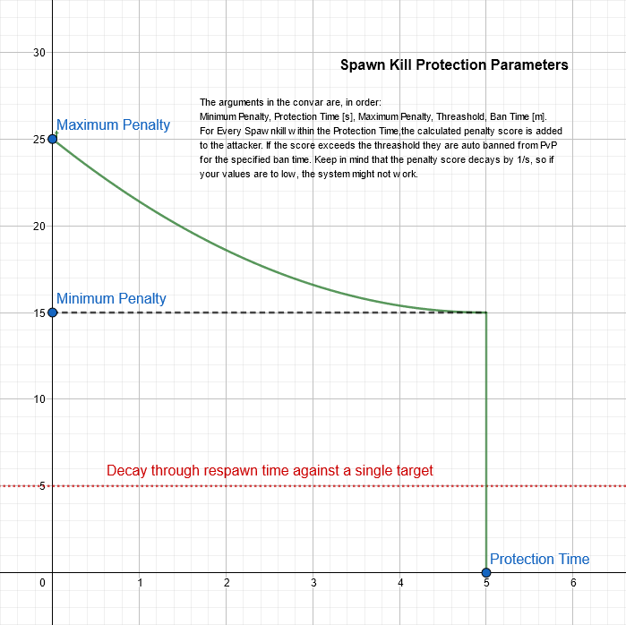

# PvP Opt In
By default no pvp and pass through enemy team players.

This plugin was written as alternative to /friendly plugins as players usually forgot to enable it or were unhappy with how collision groups mess up certain things like elevators. So hopefully by putting all that on it's head, there wont ever be the need to report for RDM again!

### Features:

- Global PvP toggle
- Pair PvP via invites, player can disable invites
- Walk through enemies base on pvp state
- Color players based on pvp state
- Sentries and bots ignore non-pvp players
- Fully translatable
- Blocks various conditions between non-pvp players
- Prevent players pushing eachother with e.g. loose cannon outside of pvp
- Bosses and Skeleton ignore players that are not in PvP (see ConVars)
- Generates a config at cfg/sourcemod/plugin.pvpoptin.cfg
- Banning players from PvP
- Protection agains spawn killing (for maps without locker room)

*Note on Supressing AI Targeting:* Due to how the targeting for sentries and some bosses is implemented,
supressing a player or entity from being targeted results in the sentry or boss not seeing any enemy and idling or
entering a false positive state.

### ConVars:

**`pvp_joinoverride "0"`**   
Define global PvP State when player joins.   
0 = Load player choice, 1 = Force out of PvP, -1 = Force enable PvP

**`pvp_nocollide "1"`**   
Can be used to disable player collision between enemies.   
0 = Don't change, 1 = with global pvp disabled, 2 = never collied

**`pvp_gamestates "all"`**   
The game states when this plugin should be active or all if it should always run. Following states are possible: all, waiting, pregame, running, overtime, suddendeath, gameover

**`pvp_requestmenus "1"`**   
When players request pair PvP: 0 = requeste will have to use /pvp requester, 1 = requestee will receive a menu, 2 = will force VGUI menus

**`pvp_buildings_vs_zombies "2"`**   
Control sentry <-> skeleton targeting.   
Possible values: -1 = Fully ignore, even manual damage, 0 = Never target, 1 = Global PvP only, 2 = This is PvE so Always

**`pvp_buildings_vs_bosses "2"`**   
Control sentry <-> boss targeting.   
Possible values: -1 = Fully ignore, even manual damage, 0 = Never target, 1 = Global PvP only, 2 = This is PvE so Always

**`pvp_players_vs_zombies "1"`**   
Control player <-> skeleton targeting.   
Possible values: -1 = Fully ignore, even manual damage, 0 = Never target, 1 = Global PvP only, 2 = This is PvE so Always

**`pvp_players_vs_bosses "1"`**   
Control player <-> boss targeting.   
Possible values: -1 = Fully ignore, even manual damage, 0 = Never target, 1 = Global PvP only, 2 = This is PvE so Always

**`pvp_playertaint_enable "1"`**   
Can be used to disable player tainting based on pvp state

**`pvp_playertaint_bluoff "255 255 225"`**   
Color for players on BLU with global PvP disabled.

**`pvp_playertaint_bluon "255 125 125"`**   
Color for players on BLU with global PvP enabled.

**`pvp_playertaint_redoff "255 255 225"`**   
Color for players on RED with global PvP disabled.

**`pvp_playertaint_redon "125 125 255"`**   
Color for players on RED with global PvP enabled.

For all colors for format is `R G B A` from 0 to 255 or web color `#RRGGBBAA`. Alpha is optional.

**`pvp_playerparticle_enable "1"`**   
Play a particle on players that can be PvPed (`mark_for_death`). Playes for both global and pair PvP.

There is a really cool pvp inicator particle system in the `clientmod/` directory, but due to how TF2 is not loading 
custom particle systems from the server, I can't use it. In case you want to take a look, I added some instructions on
how to use the particle. Thanks to FancyNight and sigmarune for making that custom particle system :)

**`pvp_spawnkill_protection "15 5 35 100 60"`**   
Set up spawn protection. Set to an empty value to disable.
Parameters in order are: Minimum Penalty, Protection Time [s], Maximum Penalty, Threashold, Ban Time [m]

**`pvp_toggle_action "0"`
Decides what to do when a player toggles global PvP. Set this convar to the sum of flags.
Flags: 1 - Respawn when turning on, 2 - Kill when turning on, 4 - Respawn when turning off, 8 - Kill when turning off.
If you set 1 or 2, the cooldown for leaving will not apply until the player was tagged by shooting or getting shot.

### Commands:

**`/pvp`**   
Toggle global PvP on or off

**`/pvp player`**   
Invite to, accept and end pair PvP with another player.
If the player was not found, get a menu.

**`/pvpinvite [player]`**
Forces the pick player menu if no argument is given, haves like /pvp otherwise

**`/stoppvp`**   
End pair PvP with all players.
If no pair PvP running, toggle ignore state.

**`/forcepvp <target|'map'> <0|1>`**   
Override the targets global pvp choice. If you use 'map' it will apply to all players joining the server. Non persistent (will reset on map change). Requires admin flag Slay.

**`/mirror <target> <0|1>`**   
Force mirror damage on someone. Mirror damage only affects players that are not PvPing, and is only for fun.

**`/mirrorme`**   
Mirror your damage agains non-PvP players.

**`/fakepvprequest <requester> <requestee>`**   
Send a pair PvP request from requester to requestee.

**`/banpvp <#userid|name> <minutes> [reason]`**   
Ban a player from PvP. Time has to be positive integer. (1440 is a day)
If you omit minutes and reason, it will tell you whether the player is already banned.
Note: If you can't type their name, check `status` in console and use the #userid in the first column.

**`/unbanpvp <#userid|name>`**   
Unban a player from PvP.
Note: If you can't type their name, check `status` in console and use the #userid in the first column.

**New Target Selectors:**
- `@pvp` Select all players with global PvP enabled
- `@!pvp` Select all players with global PvP enabled

There's also a settings menu to toggle global PvP and pair PvP.

### Dependencies:

Install the following required plugins:
- [CollisionHook](https://github.com/voided/CollisionHook/releases)
- [TF Utils](https://github.com/nosoop/SM-TFUtils/releases)
- [NativeVotes](https://github.com/sapphonie/sourcemod-nativevotes-updated) (Optional)

The CollisionHook branch I linked is prebuilt, but the **gamedata might be outdate**.
Check [this file](https://github.com/voided/CollisionHook/blob/master/sourcemod/gamedata/collisionhook.txt), it should be up to date.

Compiling the plugin requires [Multi-Colors](https://github.com/Bara/Multi-Colors)

Note: uses two functions from [SMLib's transitional syntax branch](https://github.com/bcserv/smlib/tree/transitional_syntax) (in utils.sp)

